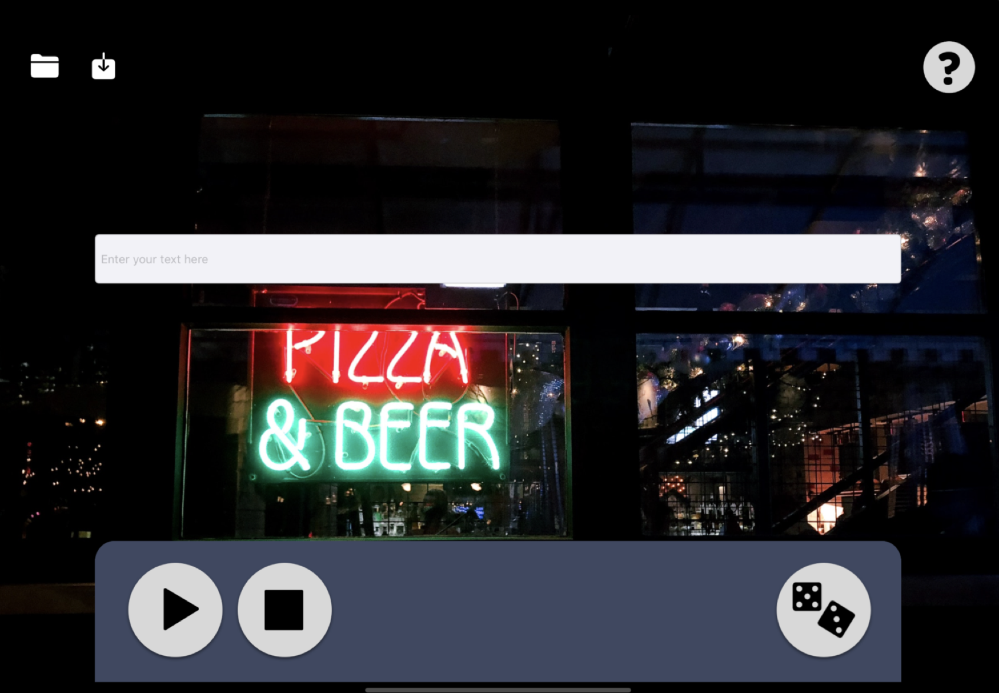
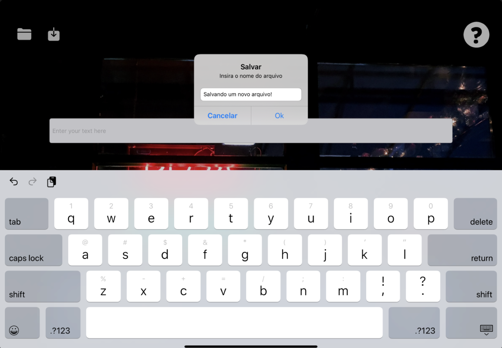
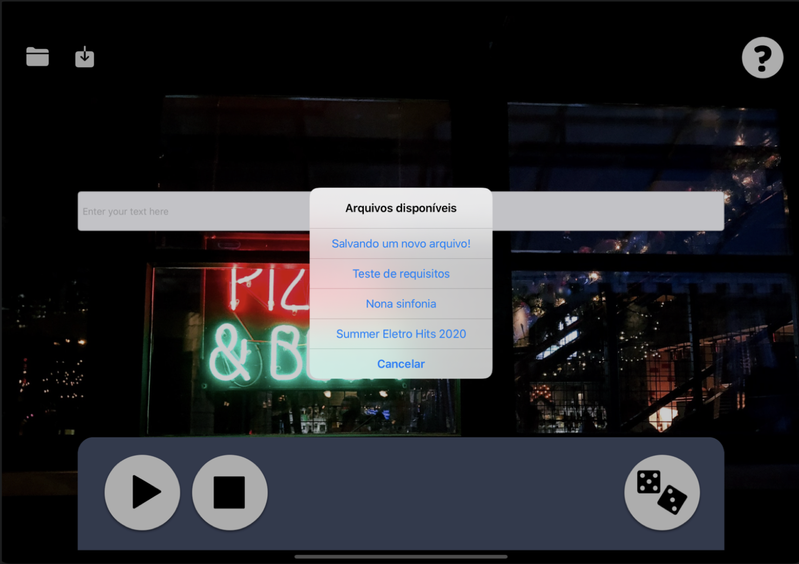

# Music Generator

Music Generator is an assignment for Software Construction Techniques. Besides, the objective of the assignment was to create an audio player that plays according to the text inputted by the user. Therefore, the software contains the following features:

* Sound played based on the text read
* Pitch modification
* Speed modification
* Sound volume modification
* Save and open txt files
* Multiple instruments

# Technologies

* The software was made in Swift, using AVFoundation to play sounds and to modify them.
* In order to play the sound in correct order, it was used a semaphore to enable and to stop the threads. 
* It was used Swift File Manager to save and load txt files. 

# Screens

The layout was previously made by me using Sketch, and then replicated on the project. 

